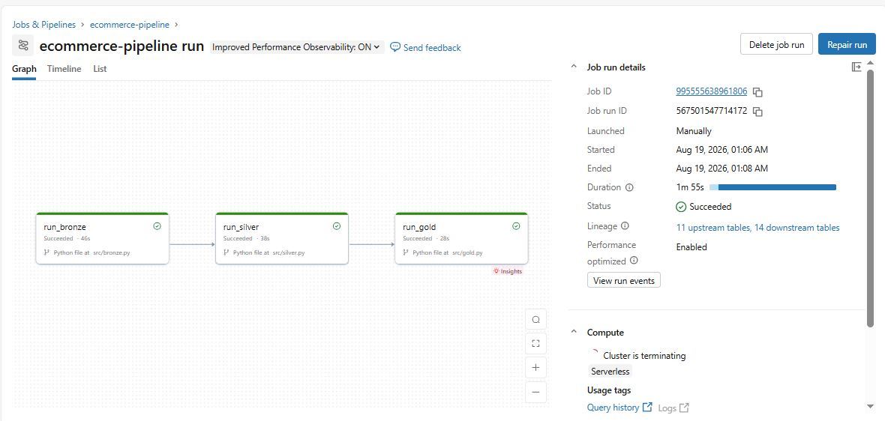

# Ecommerce Lakehouse Pipeline

A production-oriented Bronze → Silver → Gold e-commerce lakehouse pipeline built with Databricks, PySpark, Delta Lake, and Unity Catalog. The pipeline ingests raw e-commerce CSV data, performs structural validation, deduplication, business-rule filtering, and referential-integrity checks, and produces a star schema for BI reporting.


## Architecture

```
Raw CSVs (Unity Catalog Volumes)
        │
        ▼
   BRONZE  →  raw ingestion + structural validation (schema, not-empty, null keys)
        │
        ▼
   SILVER  →  dedup, type casting, business-rule filtering, referential integrity
        │
        ▼
    GOLD   →  star schema: fact_order_items + dim_products, dim_customers, dim_date
```

**Tables:** customers, products, orders, order_items, payments, shipments, returns

### Pipeline Flow

1. **Bronze** — Ingests raw CSV files from Unity Catalog Volumes and performs structural validation.
2. **Silver** — Deduplicates records, applies data types and business rules, and validates referential integrity.
3. **Gold** — Builds the analytical star schema consisting of the fact table and dimension tables.

## Tech Stack

- PySpark / Spark SQL
- Delta Lake
- Databricks Workflows (job orchestration)
- Unity Catalog (storage, Volumes)
- YAML (config-driven validation)
- pytest (unit testing)

## Project Structure

```text
ecommerce-lakehouse-pipeline/
├── docs/
│   └── images/
│       └── databricks-workflow.JPG
├── src/
│   ├── config/
│   │   └── bronze_tables.yaml
│   ├── tests/
│   │   └── test_validation.py
│   ├── utils/
│   │   ├── config.py
│   │   └── logging_config.py
│   ├── bronze.py
│   ├── silver.py
│   ├── gold.py
│   └── validation.py
├── .gitignore
├── README.md
└── requirements.txt
```

## Design Considerations

### Bronze Layer

| Decision | Reasoning |
|---|---|
| `inferSchema=True` on CSV read | Fast to build; **known gap** — production would use an explicit `StructType` schema per table for real schema-drift protection. |
| Per-table try/except, isolated failures | 8 independent source tables — one bad table shouldn't block the other 7 from loading. |
| Hard-fail at job level (`raise RuntimeError`) after the loop | Every table is still attempted, but the job shows red if anything failed, so it surfaces to the orchestrator/on-call rather than failing silently. |
| `mode("overwrite")` | Deliberate dev-stage choice for a one-time batch load. **Known gap** — production with daily incremental loads would use `mode("append")` combined with a `batch_id`/`run_id` column and a `DeltaTable.delete(f"batch_id = '{run_id}'")` before the append, to make retries idempotent. |
|Structural validation with table-level failure isolation | Bronze validates *structure* (schema, not-empty, null primary keys) — not business rules. Business-rule quarantining happens in silver. |
| No persisted audit/run log | `failures` is in-memory only, lost when the script ends. **Known gap** — production would write failures to a persisted `_ingestion_log` Delta table. |

### Silver Layer

| Decision | Reasoning |
|---|---|
| Dedup via `row_number()` window function, latest by `ingestion_timestamp` | More control than `dropDuplicates()` — lets me pick which duplicate survives rather than an arbitrary one. |
| Price fields cast to `DecimalType(10,2)` | Avoids floating-point rounding errors on financial data; explicit precision instead of relying on inferred numeric types. |
| `Row-level filtering via .filter()` for row-level business rule violations (`price > 0`, `qty > 0`, `status.isin([...])`) | Invalid rows are filtered from the Silver output while before/after row counts are logged. |
| Referential integrity via broadcast inner-join, using a reusable `check_referential_integrity()` helper in `validation.py` | Foreign keys (e.g. `orders.customer_id` → `customers.customer_id`) are validated by joining against the parent table's deduplicated key set. `F.broadcast()` avoids shuffling the larger child table. Centralized this in one helper for modularity. |
| Explicit dependency declaration (`silver_functions` dict maps table → `(func, depends_on)`) with a `completed` set checked before each run | Referential checks create a real execution-order dependency (`customers` before `orders`, `orders`/`products` before `order_items`, etc.), this makes the dependency explicit and self-documenting, and skips (rather than crashes) a table if its dependency didn't complete. |
| No SCD (Slowly Changing Dimension) handling | If a customer's `city` changes, `overwrite` just replaces the old value with no history. **Known gap** — a real dimension would likely use SCD Type 2 (valid-from/valid-to tracking via `DeltaTable.merge()`) to preserve history. |

### Gold Layer

| Decision | Reasoning |
|---|---|
| Star schema, grain = `order_items` | `orders`, `payments`, `shipments`, `returns` are all independently "fact-like," but centering on `order_items` as the atomic fact avoids double-counting. `orders` becomes enrichment (customer_id, order_date) joined into the fact rather than a separate fact table. |
| `dim_date` generated independently as a full calendar spine (`sequence()` + `explode()`), not derived from fact table dates | A date-derived-from-facts dimension would be missing any date with zero orders. |
| Row-count integrity check after the fact-table join (`raise ValueError` on mismatch) | An unexpected join-driven row drop in the fact table is a real data-integrity signal, wired into the same try/except/fail-loud pattern as the rest of the pipeline. |
| `check_unique()` on dimension keys | Enforces uniqueness at the application level, since Delta doesn't enforce PK constraints by default. |
| Data layout| `order_month` is used as a coarse partitioning strategy for the fact table to support common time-based access patterns. For larger production tables, Databricks recommends evaluating liquid clustering based on workload and access patterns. |
| No informational PK/FK constraints declared in Unity Catalog | These are metadata-only (not enforced at write time) and mainly benefit BI tools querying the catalog. |

## Databricks Workflow

The pipeline is orchestrated using a Databricks Job with task dependencies:

`run_bronze → run_silver → run_gold`

Each task executes the corresponding PySpark script directly from the GitHub `main` branch.

The job runs on Databricks Serverless compute and is configured with task retries and job-level email notifications for failed runs.



## Git Workflow

Development follows a feature-branch and pull-request workflow:

```text
Feature branch
      ↓
   Commit
      ↓
    Push
      ↓
Pull Request
      ↓
  Merge → main
      ↓
Databricks Job
```

## Testing

Unit tests cover the core validation functions in `validation.py` using `pytest` and a local single-node SparkSession. These tests can run independently of Databricks.

Run the tests with:

```bash
cd src
pytest tests/test_validation.py -v
```

## Known Limitations / Next Steps

- Explicit schema definitions in bronze (replacing `inferSchema`) for real schema-drift protection
- Incremental/idempotent processing using deterministic batch identifiers and Delta `MERGE` operations where appropriate
- Persisted audit/run log (currently in-memory only, lost after each run)
- SCD Type 2 handling for slowly-changing dimension attributes
- Broader unit test coverage (`check_unique`, `check_referential_integrity`, transform-level logic)
- Row-level quarantine tables for rejected records instead of only filtering invalid rows
- Automated CI testing on pull requests
- Environment separation for development, staging, and production

## Setup / How to Run

### Prerequisites

- Databricks workspace with Unity Catalog
- Access to a Databricks Serverless compute environment
- GitHub repository connected to Databricks
- Source CSV files uploaded to the configured Unity Catalog Volume

### Databricks

1. Connect the GitHub repository to the Databricks Job.
2. Configure the required catalog, schema, and Volume paths in `src/utils/config.py`.
3. Ensure the required Bronze source data is available.
4. Run the Databricks Job.

The workflow executes:

```text
run_bronze → run_silver → run_gold
```